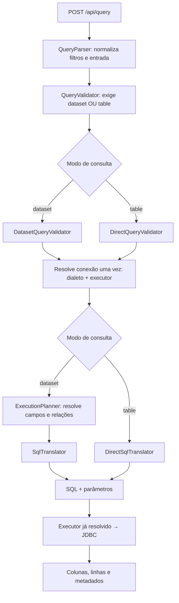

# Atlas Query Engine

**Motor de consultas declarativas que transforma JSON em SQL parametrizado e executa consultas em bancos relacionais.**

O Atlas Query Engine permite que uma aplicação descreva os dados que deseja consultar — campos, filtros, métricas, agrupamento, ordenação e paginação — por meio de um contrato JSON. O engine normaliza e valida essa descrição, gera o SQL de acordo com o dialeto do banco e devolve colunas, linhas e metadados da execução.

O projeto reúne uma biblioteca Java reutilizável e uma aplicação Spring Boot que expõe o motor por HTTP e demonstra seu uso com conexões locais e externas.

## Qual problema ele resolve?

Telas de relatórios e dashboards costumam precisar de combinações variáveis de filtros, campos e agregações. O Atlas centraliza a interpretação dessas consultas em um pipeline, permitindo reutilizar as regras de validação, a resolução de campos e a geração de SQL.

Por exemplo, uma aplicação pode pedir **“o total de vendas pagas por país, do maior para o menor”** enviando uma estrutura JSON. O engine traduz esse pedido para uma consulta SQL e o banco realiza o processamento dos dados.

A proposta é funcionar como uma camada de consulta para aplicações que precisam de relatórios dinâmicos, ferramentas internas e APIs de dados.

## Exemplo de consulta

O endpoint da aplicação de demonstração é `POST /api/query`.

```json
{
  "dataset": "orders",
  "select": ["country"],
  "filters": {
    "operator": "AND",
    "conditions": [
      { "field": "status", "operator": "=", "value": "PAID" }
    ]
  },
  "metrics": [
    { "field": "amount", "operation": "sum", "alias": "totalAmount" }
  ],
  "groupBy": ["country"],
  "sort": [
    { "field": "totalAmount", "direction": "desc" }
  ],
  "page": 1,
  "pageSize": 50
}
```

No dialeto PostgreSQL, esse pedido gera um SQL equivalente a:

```sql
SELECT t0.country AS "country", SUM(t0.amount) AS "totalAmount"
FROM "public"."orders" t0
WHERE t0.status = ?
GROUP BY t0.country
ORDER BY "totalAmount" DESC
LIMIT 50 OFFSET 0
```

O valor `PAID` é enviado separadamente como parâmetro JDBC. A resposta contém os nomes das colunas, as linhas retornadas e metadados como tempo de execução, página, tamanho da página e quantidade de linhas retornadas naquela página.

## Dois modos de consulta

Cada consulta deve informar exatamente um destino: `dataset` ou `table`.

| Modo | Como funciona | Recursos |
| --- | --- | --- |
| **Dataset** | Usa um catálogo que associa nomes lógicos a tabelas e colunas físicas. | Campos permitidos, tipos, operações de agregação e relações predefinidas; joins derivados do catálogo. |
| **Direto por tabela** | Recebe tabela, schema e referências de colunas na própria requisição. | Joins explícitos, projeções, expressões e subconsultas correlacionadas com `EXISTS`. |

No modo dataset, o catálogo pode expor `customerName` como um campo lógico e resolver a relação necessária para chegar à coluna física correspondente.

No modo direto, os identificadores e a estrutura da consulta são validados, mas as restrições do catálogo de datasets não se aplicam. O acesso aos objetos consultados depende também das permissões da conexão utilizada.

## Arquitetura



O catálogo é configurado na inicialização da aplicação. Durante uma consulta por dataset, ele orienta a validação e o planejamento. O planner resolve campos e relações; o otimizador do próprio banco determina como executar o SQL gerado.

Na aplicação demo, a configuração da conexão é resolvida uma vez por consulta. O dialeto e o executor usam essa mesma configuração, evitando consultas repetidas ao cadastro e divergências entre tradução e execução.

## Estrutura do repositório

```text
.
├── README.md                         # Visão geral do projeto
└── atlas-query-engine/
    ├── pom.xml                       # Projeto Maven agregador
    ├── mvnw                          # Maven Wrapper
    ├── README.md                     # Detalhes de uso e contratos
    ├── atlas-query-engine-core/      # Biblioteca do motor de consultas
    ├── atlas-query-engine-demo/      # API HTTP e integração Spring Boot
    ├── docker-compose.yml            # PostgreSQL e MySQL para laboratório
    └── docker/                       # Inicialização dos bancos locais
```

**Core:** modelos de consulta, catálogo configurável, normalização, validação, planejamento, dialetos SQL, tradução e executor JDBC.

**Demo:** endpoint HTTP, configuração do engine, datasets de exemplo, persistência e criptografia das configurações de conexão, roteamento para bancos externos e migrações Flyway.

## Recursos implementados

- Filtros simples e grupos aninhados com `AND` e `OR`.
- Agregações `COUNT`, `SUM`, `AVG`, `MIN` e `MAX`.
- Agrupamento, ordenação e paginação, com até 500 linhas por página.
- Catálogo de datasets com campos lógicos, tipos e relações.
- Consultas diretas com joins, expressões e `EXISTS`.
- Dialetos SQL para PostgreSQL, MySQL e Oracle.
- Execução com parâmetros JDBC separados do SQL.
- Cadastro de conexões com campos de configuração criptografados usando AES-GCM.
- Renovação do cache de datasources quando a configuração de uma conexão muda.
- Testes unitários e de integração com H2, incluindo o pipeline JSON → engine → JDBC e a configuração Spring.

## Tecnologias

| Área | Tecnologias |
| --- | --- |
| Linguagem e build | Java 25, Maven e Maven Wrapper |
| Aplicação e integração | Spring Boot 4.0.3, Spring MVC e Spring JDBC |
| Contratos e validação | Jackson e Jakarta Bean Validation |
| Persistência do demo | PostgreSQL e Flyway |
| Drivers e dialetos | PostgreSQL, MySQL e Oracle |
| Testes | JUnit, AssertJ e H2 |
| Ambiente local | Docker Compose |

## Como executar localmente

Pré-requisitos: JDK 25 e Docker com Docker Compose. O Maven Wrapper está incluído no projeto.

A partir da raiz deste repositório:

```bash
cd atlas-query-engine

docker compose up -d atlas-postgres

./mvnw install
./mvnw -pl atlas-query-engine-demo spring-boot:run
```

Aguarde o PostgreSQL ficar saudável antes de iniciar a aplicação. O comando `install` compila os módulos, executa os testes e disponibiliza o core no repositório Maven local para o módulo demo.

Por padrão, a API fica em `http://localhost:8030`. Exemplo de chamada:

```bash
curl -X POST http://localhost:8030/api/query \
  -H 'Content-Type: application/json' \
  -d '{"dataset":"orders","select":["country","status"],"page":1,"pageSize":10}'
```

Para executar somente os testes, dentro de `atlas-query-engine/`:

```bash
./mvnw test
```

Configuração, contratos e instruções adicionais estão no [README dos módulos](atlas-query-engine/README.md).

## Escopo atual

O repositório contém uma biblioteca em evolução e um laboratório executável. Os padrões de configuração do demo são voltados ao desenvolvimento local.

Cada consulta executa em uma única conexão. Os dialetos adaptam a geração de SQL aos bancos suportados; não há execução distribuída nem joins entre conexões diferentes.

O ambiente Docker inclui PostgreSQL e MySQL. Oracle possui driver e dialeto no código, mas não está incluído no laboratório Docker. Os testes com H2 não substituem a validação de compatibilidade com cada banco real.

Os DTOs de entrada continuam mutáveis, e as conexões externas usam `DriverManagerDataSource`, sem pool. Um modelo interno totalmente imutável e pooling de conexões são possíveis próximos passos.
